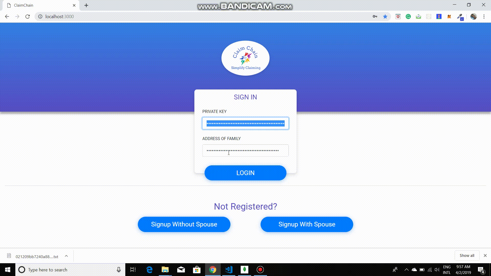

<h2 align="center">ClaimChain</h2>

<p align="center">
  <a href="" rel="noopener">
 </a>
</p>

<h3 align="center">Family Tree on Blockchain</h3>

------------------------------------------

>To Implement `Family tree` on Blockchain to solve the `verification issue` at various stages in the application for succession certificate at court.


------------------------------------------
### Features

- `Safe` as all the credentials are encrypted using asymmetric encryption.
- `Reliable` as all the data is stored in a decentralized way.
- `Efficient` considering the scalability factor, data gets stored off chain without compromising security.


------------------------------------------
### Demo
<div align="center">

<br>
<h1>Signup</h1>
<p align="center">

</p>

<br>
<h1>Login</h1>
<p align="center">

</p>

</div>


### Installation

``` sh
- git clone https://github.com/devanshslnk/ClaimChain.git
```
``` sh
- cd ClaimChain/express_app
```
``` sh
- npm install
```
``` sh
- node app.js
```

------------------------------------------

### Additional Details

see Project Report [here](https://github.com/devanshslnk/ClaimChain/blob/master/ClaimChain%20Report.pdf)

------------------------------------------
### Contributing

 We're are open to `enhancements` & `bug-fixes` :smile:  

------------------------------------------
### Contributors

- [@devanshslnk](https://github.com/devanshslnk)(Also contributed through Devansh Solanki)
- [@mihir-ms](https://github.com/mihir-ms)(Also contributed through Mihir Shah)
- [@priyamshah112](https://github.com/priyamshah112)

-------------------------------------------

